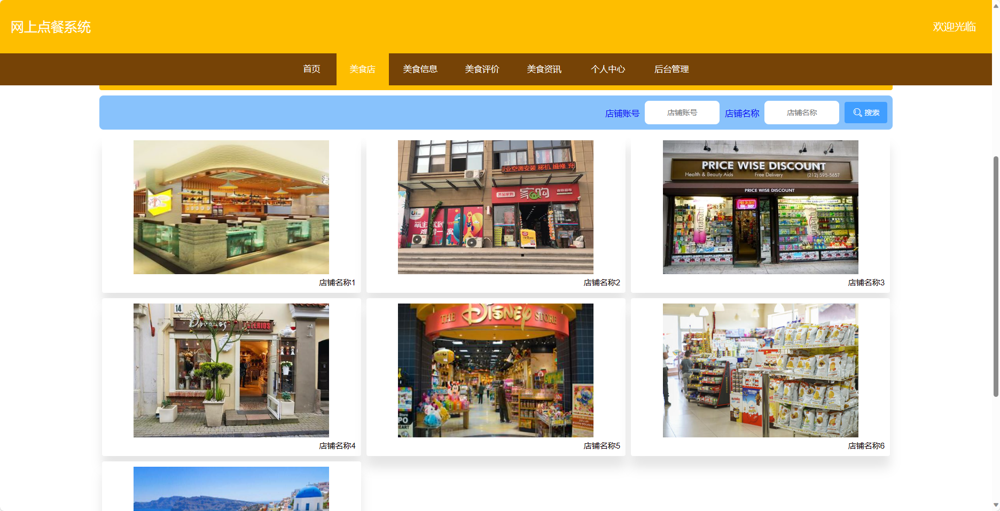
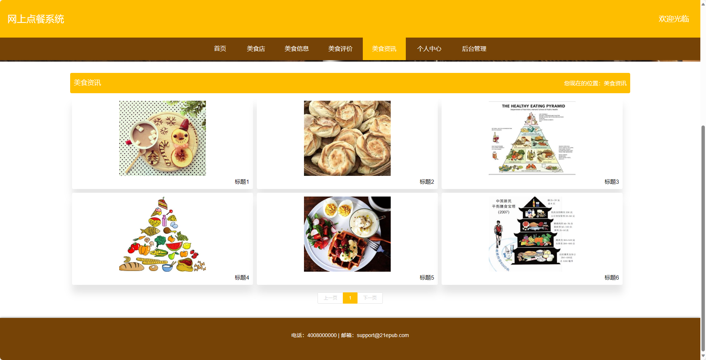
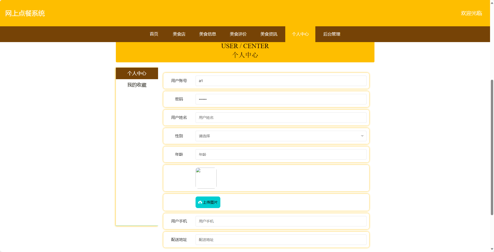
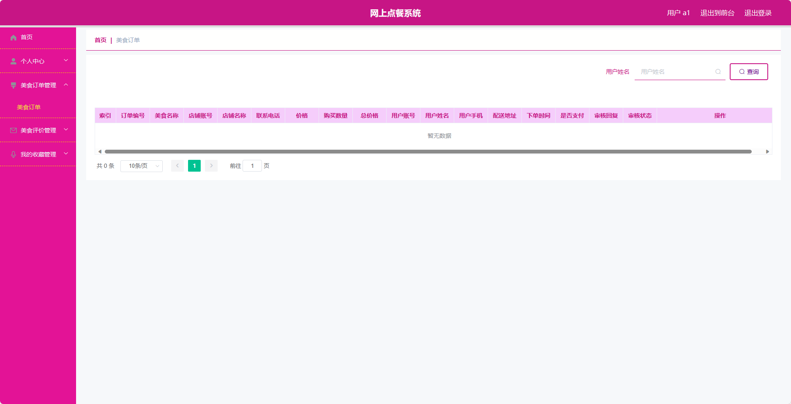

基于SpringBoot的网上点餐系统（程序+论文）
=
- 完整代码获取地址：从戎源码网 ([https://armycodes.com/](https://armycodes.com/))
- 作者微信：19941326836  QQ：952045282 
- 承接计算机毕业设计、Java毕业设计、Python毕业设计、深度学习、机器学习
- 选题+开题报告+任务书+程序定制+安装调试+论文+答辩ppt 一条龙服务

一、项目介绍
---
基于Spring Boot框架实现的网上点餐系统，系统包含三种角色：管理员、美食店、用户,系统分为前台和后台两大模块，主要功能如下。
### 前台模块：
1. 首页：展示系统的概要信息和热门推荐。
2. 美食店：展示各个美食店的信息，包括店名、地址、联系方式等。
3. 美食信息：展示美食的详细信息，包括菜品名称、价格、口味等。
4. 美食评价：用户可以对美食进行评价和评论。
5. 美食资讯：提供用户美食相关的资讯和新闻。
6. 个人中心：用户可以查看个人信息、修改密码等操作。

### 后台模块：
1. 管理员个人中心：管理员可以查看个人信息、修改密码等操作。
2. 用户管理：管理员可以管理系统中的用户，包括查看用户信息、禁用用户等。
3. 美食店管理：管理员可以管理美食店的信息，包括添加、删除、修改店铺信息。
4. 美食分类管理：管理员可以对美食进行分类管理，包括添加、删除、修改分类信息。
5. 美食信息管理：管理员可以管理美食的详细信息，包括添加、删除、修改美食信息。
6. 美食订单管理：管理员可以管理美食的订单信息，包括查看订单、取消订单等。
7. 美食评价管理：管理员可以管理美食的评价信息，包括查看评价、删除评价等。
8. 系统管理：管理员可以管理系统的一些配置参数。 

### 用户模块：
1. 个人中心：用户可以查看个人信息、修改密码等操作。
2. 美食订单管理：用户可以查看自己的美食订单信息，包括订单状态、付款情况等。
3. 美食评价管理：用户可以对已消费过的美食进行评价和评论。
4. 我的收藏管理：用户可以管理自己收藏的美食店和美食信息。
5. 美食店模块：
   - 个人中心：美食店可以查看自己的信息、修改密码等操作。
   - 美食信息管理：美食店可以管理自己所提供的美食信息，包括添加、删除、修改美食信息。
   - 美食订单管理：美食店可以查看自己店铺的美食订单信息，包括订单状态、接单情况等。
   - 美食评价管理：美食店可以查看用户对自己店铺的评价和评论。

二、项目技术
---
- 编程语言：Java
- 数据库：MySQL
- 项目管理工具：Maven
- 前端技术：VUE、HTML、Jquery、Bootstrap
- 后端技术：Spring、SpringMVC、MyBatis

三、运行环境
---
- 操作系统：Windows、macOS都可以
- JDK版本：JDK1.8以上都可以
- 开发工具：IDEA、Ecplise、Myecplise都可以
- 数据库: MySQL5.7以上都可以
- Tomcat：任意版本都可以
- Maven：任意版本都可以

四、运行截图
---
### 论文截图：

### 程序截图：

